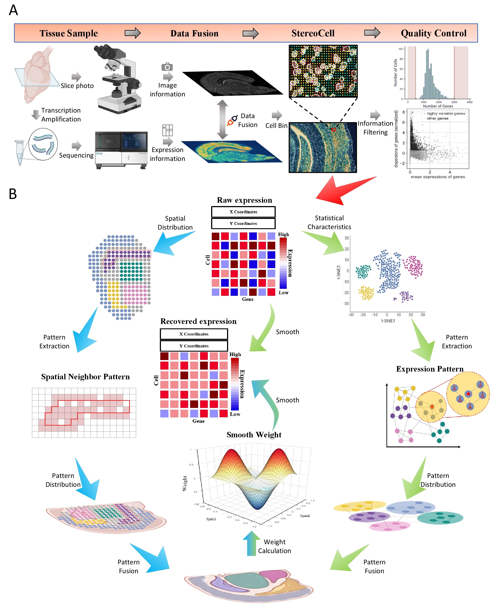

# EAGS: efficient and adaptive Gaussian smoothing applied to high-resolved spatial transcriptomics
## introduction
EAGS is a smoothing approach for spatial transcriptome data with ultrahigh resolution. 
Through the principal component information of the profiling of gene expression and the 
personally identifiable information between cells, it uses a two-factor adaptive smoothing 
weight mechanism to determine the neighborhood relationship of cells. Then it uses the 
self-developed smoothing weight formula to calculate the smoothing contribution and 
recalculate the gene expression of each cell.

This work belongs to the thematic series of Spatio-temporal omics algorithms.
## Schematic diagram


## Quick Start
The core function of the EAGS method is the `gaussian_smooth_adaptively` function provided in `EAGS_using.py`, and the 
detailed formula of this function has been given in the `GS_for_user.py`.

The following code is a quick example of running our Smoothing strategy. The function `gaussian_smooth_adaptively()` takes 
in `anndata(H5AD format)` 
object with the cell information(such as gene MID Counts in `anndata.X` , spatial coordinates in `anndata.obsm['Spatial']`). 
For more details on the input anndata(H5AD format), please check on [link](https://anndata.readthedocs.io/en/latest/).

    adata_after_smooth = gaussian_smooth_adaptively(adata=adata,
                                                    smooth_threshold=90,
                                                    a=1,
                                                    b=0,
                                                    n_comps=50,
                                                    n_neighbors=10,
                                                    normalize_zscore=True)

The parameters of  `gaussian_smooth_adaptively` are:
- `adata`: adata file need to be imputed.
- `smooth_threshold`: Control the gradient of Gaussian curve (Gaussian parameter c).
- `a`: Gaussian parameter a. 
- `b`: Gaussian parameter b.
- `n_comps`: Number of principal components to use for calculating neighborhoods. 
- `n_neighbors`: number of nearest neighbors from which to compute kernel bandwidth.
- `normalize_zscore`: Default preprocessing method for raw counts matrice. If "False", it means input anndata.X data have been normalized..

The output of `gaussian_smooth_adaptively()` is a `anndata(H5AD format)` includes:
- `adata.X`: MID counts have been smoothed.
- `adata.obsm[spatial`: Spot's spatial coordinates.

####  Warning
After smooth your gene expression matrix（adata.X）may not be filled with integer,but filled with Multiple decimal.
That's because Gauaaian_smoothing's principle. So, if you want your matrix filled with integer,
you need to multiply it and Rounding.


## Install
```bash
### enviroment by Conda
conda create -n EAGS python=3.8.12
conda activate EAGS
pip install -r requirements.txt
```

## Contact
Any questions or suggestions on EAGS are welcomed! Please report it on issues, 
or contact Tongxuan Lv (lvtongxuan@genomics.cn) or Ying Zhang (zhangying7@genomics.cn).
We recommend using [STOmics Cloud Platform](https://cloud.stomics.tech/) to access and use it.
